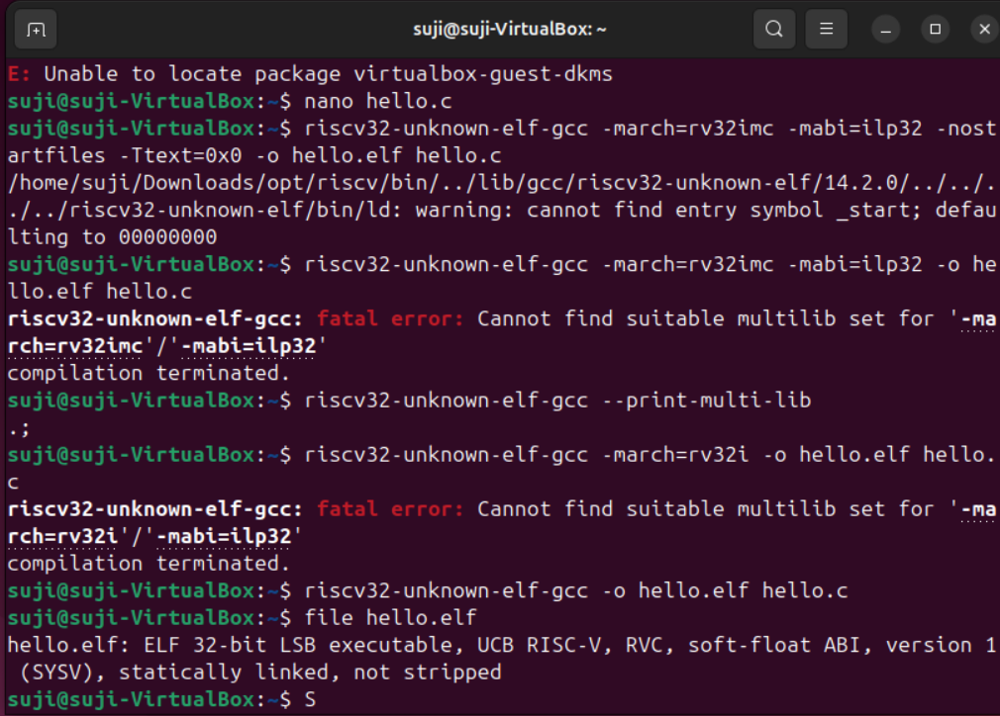

## 🛠️ Task 2: Compile “Hello, RISC-V”

### 🎯 Objective
Write and compile a minimal C program for the RISC-V 32-bit architecture using the cross-compiler.

--- 

### 📄 Step 1: Create the C Program Using nano
Open a terminal and run:
```bash
nano hello.c
```

Then type (or paste) the following code into the editor:
```c
#include <stdio.h>

int main() {
    printf("Hello, World!\n");
    return 0;
}
```

---

### 💾 Save and Exit in nano
>> Press Ctrl + O to save (write out)

>> Press Enter to confirm the filename

>> Press Ctrl + X to exit the editor

### ⚙️ Step 2: Compile the Program
Use the RISC-V compiler to generate a 32-bit ELF binary:

```bash
riscv32-unknown-elf-gcc -o hello.elf hello.c
```

---
### 🧠 Explanation of Flags

| Command / Flag              | Description                                                  |
|----------------------------|--------------------------------------------------------------|
| `riscv32-unknown-elf-gcc`  | RISC-V GCC compiler for bare-metal 32-bit targets            |
| `-o hello.elf`             | Specifies the name of the output file (ELF binary)           |
| `hello.c`                  | The source file written in C to be compiled                  |

### 🧪 Step 3: Verify the Output ELF File
Run the file command:

```bash
file hello.elf
```

---
### ✅ Expected Output:

```pgsql

hello.elf: ELF 32-bit LSB executable, UCB RISC-V, RVC, soft-float ABI, version 1 (SYSV), statically linked, not stripped
```

---
