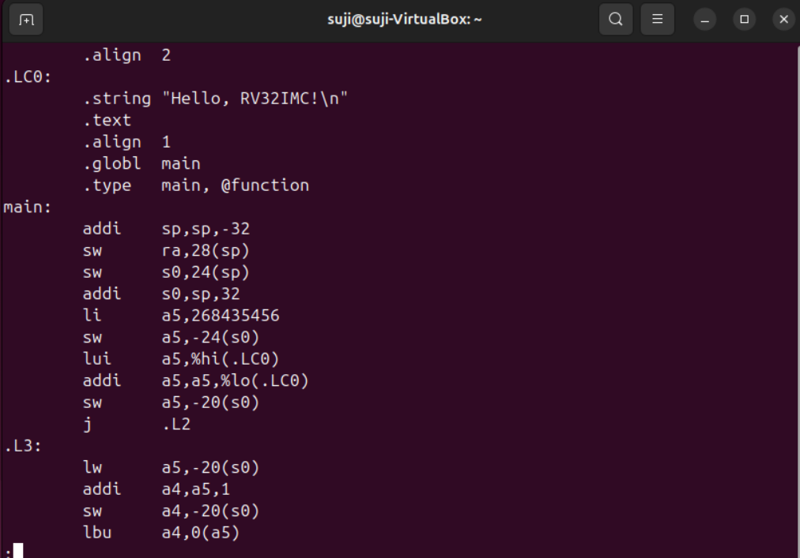

## ⚙️ Task 3: From C to Assembly

### 🎯 Objective  
Generate RISC-V assembly (`.s` file) from a C source file and understand the **function prologue and epilogue**.

---

### 📝 Step 1: Generate Assembly Code from C  
Use the following command to convert your C program (`hello.c`) into a RISC-V assembly file:

```bash
riscv32-unknown-elf-gcc -S -O0 hello.c
```
✅ This command will create a new file named hello.s in the current directory.

---


### 📄 Sample Contents of hello.s
```assembly
	.file	"hello.c"
	.option nopic
	.attribute arch, "rv32i2p1_m2p0_a2p1_c2p0"
	.attribute unaligned_access, 0
	.attribute stack_align, 16
	.text
	.section	.rodata
	.align	2
.LC0:
	.string	"Hello, World!"
	.text
	.align	1
	.globl	main
	.type	main, @function
main:
	addi	sp,sp,-16
	sw	    ra,12(sp)
	sw	    s0,8(sp)
	addi	s0,sp,16
	lui	a5,%hi(.LC0)
	addi	a0,a5,%lo(.LC0)
	call	puts
	li	    a5,0
	mv	    a0,a5
	lw	    ra,12(sp)
	lw	    s0,8(sp)
	addi	sp,sp,16
	jr	    ra
	.size	main, .-main
	.ident	"GCC: (g04696df096) 14.2.0"
	.section	.note.GNU-stack,"",@progbits

```
---


### 🧩 What is a Function Prologue?
The function prologue is a group of instructions at the beginning of a function. It:

>> Saves the return address

>> Saves any callee-saved registers (s0 in this case)

>> Allocates space on the stack (creates a stack frame)

### Prologue Instructions in main:

```assembly
Copy code
addi	sp, sp, -16     # Allocate 16 bytes on the stack
sw	    ra, 12(sp)      # Save return address
sw	    s0, 8(sp)       # Save callee-saved register (frame pointer)
addi	s0, sp, 16      # Set up new frame pointer

```

---


### 🔚 What is a Function Epilogue?
The epilogue comes at the end of the function and does the reverse of the prologue. It:

>> Restores saved registers

>> Restores the original stack pointer

>> Returns control back to the caller

### Epilogue Instructions in main:

```assembly

lw	    ra, 12(sp)      # Restore return address
lw	    s0, 8(sp)       # Restore frame pointer
addi	sp, sp, 16      # Deallocate stack space
jr	    ra              # Return to caller
```

---

