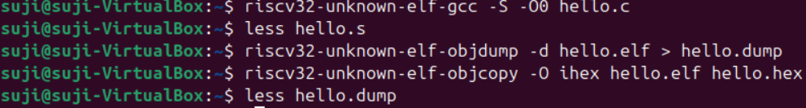
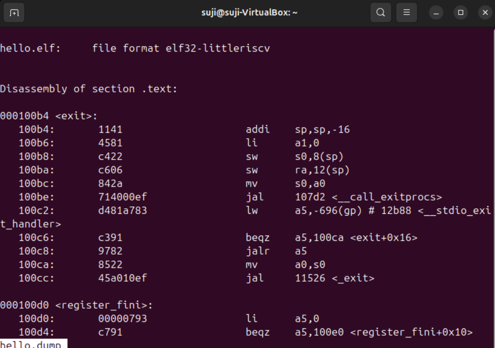

## 🧾 Task 4: Hex Dump & Disassembly

### 🎯 Objective  
Transform the compiled `hello.elf` binary into:

- An **Intel HEX** format file  
- A **human-readable assembly** (.asm) disassembly

---

### 🔧 Step 1: Generate HEX and Assembly Files

#### 📤 Convert ELF to Intel HEX:
```bash
riscv32-unknown-elf-objcopy -O ihex hello.elf hello.hex
```

✅ This command generates a hello.hex file containing a raw hex representation of the ELF binary, often used for flashing to hardware.

---

### 📂 Output Files Created

| File Name     | Description                                |
|---------------|--------------------------------------------|
| `hello.hex`   | Intel HEX formatted file generated from the ELF binary |
| `hello.asm`   | Disassembled human-readable assembly file created using `objdump` |

---

### 🔍 Breakdown of `.asm` File (Disassembly Output)

Each line in `hello.asm` typically includes the following columns:

| Column            | Description                                                              |
|-------------------|--------------------------------------------------------------------------|
| Offset Address     | Instruction address (relative to the section or function)               |
| Machine Code       | Hexadecimal representation of the compiled machine instruction          |
| Disassembled Code  | Human-readable assembly instruction (mnemonic and operands)             |

---

### 🧠 Example Disassembled Line:
```makefile
10162:	fe010113 	addi	sp,sp,-16
```

>> 10162: → Offset address

>> fe010113 → Raw machine code

>> addi sp,sp,-16 → Assembly instruction

---

### 🧱 Instruction Anatomy
Mnemonic — This is the instruction operation, like:

>> addi – Add Immediate

>> lw – Load Word

>> sw – Store Word

>> jal – Jump and Link

Operands — These specify the data the instruction works with:

>> Registers: e.g., sp, a0, s0

>> Immediate values: Constants like -16

>> Memory addresses: For jumps or loads/stores

---

✅ With this disassembly, you can now trace how your high-level C code is translated into low-level RISC-V machine instructions!

---




