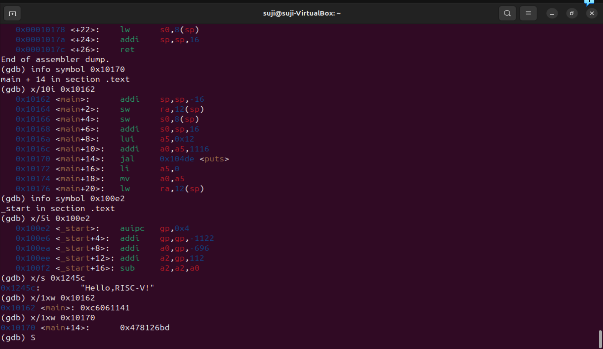

## ✅ Task 6: Stepping with GDB – Summary

### 🎯 Objective  
Use `riscv32-unknown-elf-gdb` to debug your RISC-V ELF binary by setting a breakpoint, stepping through code, and inspecting registers.

---

### 🛠️ Commands Used

| Command                           | Purpose                                                  |
|-----------------------------------|----------------------------------------------------------|
| `riscv32-unknown-elf-gdb hello.elf` | Launch GDB with your ELF binary                        |
| `target sim`                      | Connect to the RISC-V simulator                          |
| `break main`                      | Set a breakpoint at the `main` function                  |
| `run`                             | Start program execution                                  |
| `disassemble main`               | View assembly instructions of `main()`                   |
| `info reg a0`                    | Inspect value of register `a0`                           |
| `x/i 0x10162`                    | Examine 1 instruction at memory address `0x10162`        |
| `x/10i 0x10162`                  | Examine 10 instructions from address `0x10162`           |
| `x/s 0x1245c`                    | View string at memory address `0x1245c`                  |
| `x/1wx 0x10170`                  | Examine 1 word in hex at address `0x10170`               |

---

### 🧠 Outcome

- ✅ Breakpoint set at `main`
- ✅ Assembly instructions inspected
- ✅ Register `a0` and memory values examined
- ✅ Successfully traced execution step-by-step

---
